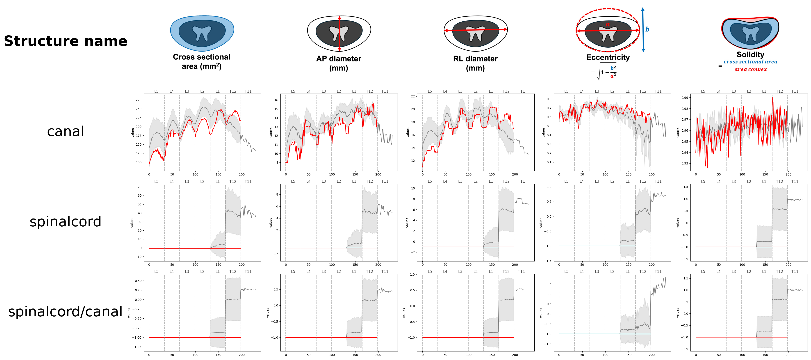

# SpineReports

Automated extraction of spinal morphometrics and generation of structured radiological reports from MRI data.

| Canal report |
| :---: |
|  | 

| Discs report |
| :---: |
|  |

| Foramens report |
| :---: |
|  |

| Vertebrae report |
| :---: |
|  |

In these report examples:
- The background violin plot in gray (or lineplot for the canal) corresponds to the **control group** (multiple subjects)
- The red line in each graph and the pictures correspond to a specific subject in the **test group**. Reports are only generated for the test group.

## How to install ?

1. Open a `bash` terminal in the directory where you want to work.

2. Create and activate a virtual environment using python >=3.10 (highly recommended):
   - venv
   ```bash
   python3 -m venv venv
   source venv/bin/activate
   ```
   - conda env
   ```
   conda create -n myenv python=3.10
   conda activate myenv
   ```

3. Install TotalSpineSeg:
   see information [here](https://github.com/neuropoly/totalspineseg#installation)

4. Install SpineReports:
   ```bash
   git clone git@github.com:ivadomed/SpineReports.git
   cd SpineReports
   pip install .
   ```

## How to generate the reports ?

1. Regroup all niftii files into a folder
> They need to follow the BIDS naming convention (i.e. `sub-<participant_label>_<contrast>.nii.gz`)
```
INPUT_FOLDER/
    subject1_T1w.nii.gz
    subject2_T2w.nii.gz
    subject3_T2w.nii.gz
    subject7_T2w.nii.gz
    ...
``` 

2. Run TotalSpineSeg to get generate the segmentations in the 1mm isotropic space
> Perform this for both your control group and test group
```
totalspineseg -i INPUT_FOLDER -o OUTPUT_FOLDER --iso
```

3. Run SpineReports to generate the reports
```
```

