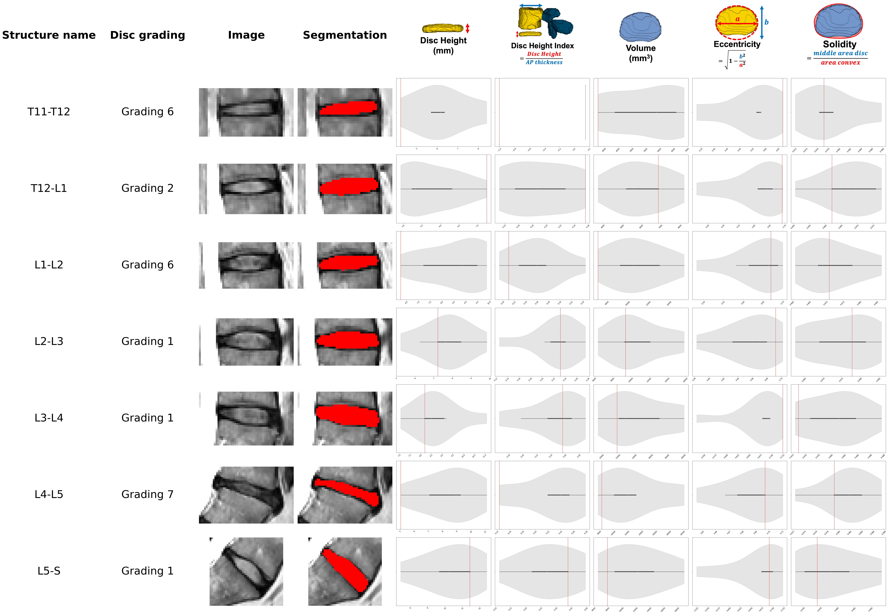
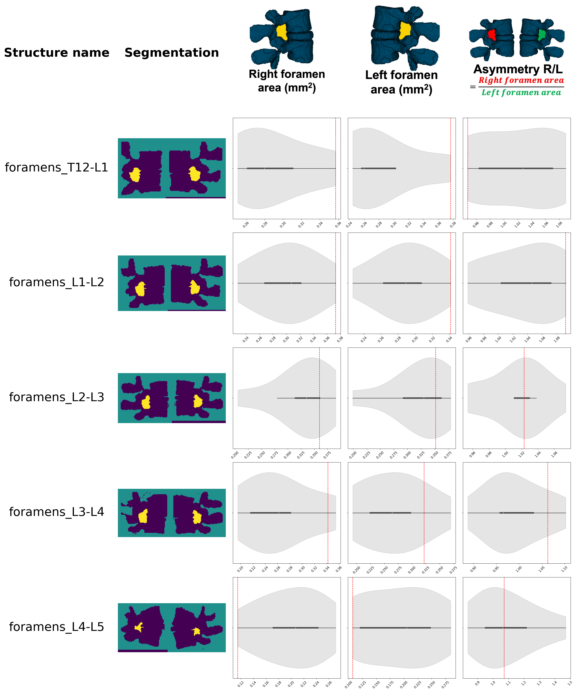
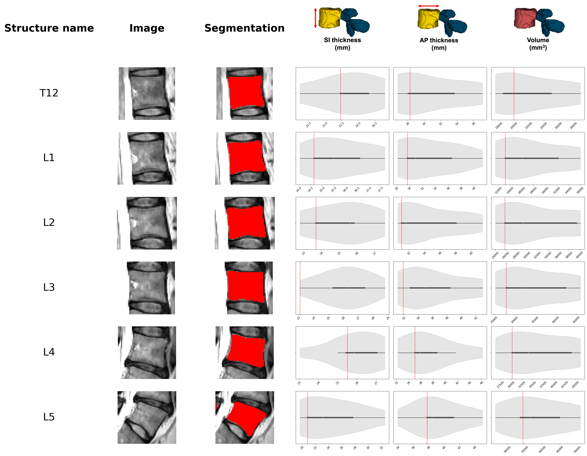

# SpineReports

Automated extraction of spinal morphometrics and generation of structured radiological reports from MRI data.

| Canal report |
| :---: |
|  | 

| Discs report |
| :---: |
|  |

| Foramens report |
| :---: |
|  |

| Vertebrae report |
| :---: |
|  |

In these report examples:
- The background violin plot in gray (or lineplot for the canal) corresponds to the **control group** (multiple subjects)
- The red line in each graph and the pictures correspond to a specific subject in the **test group**. Reports are only generated for the test group.

## How to install ?

1. Open a `bash` terminal in the directory where you want to work.

2. Create and activate a virtual environment using python >=3.10 (highly recommended):
   - venv
   ```bash
   python3 -m venv venv
   source venv/bin/activate
   ```
   - conda env
   ```
   conda create -n myenv python=3.10
   conda activate myenv
   ```

3. Install TotalSpineSeg:
   see information [here](https://github.com/neuropoly/totalspineseg#installation)

4. Install SpineReports:
   ```bash
   git clone git@github.com:ivadomed/SpineReports.git
   cd SpineReports
   pip install .
   ```

## How to generate the reports ?

1. Regroup all niftii files into a folder
> They need to follow the BIDS naming convention (i.e. `sub-<participant_label>_<contrast>.nii.gz`)
```
INPUT_FOLDER/
    subject1_T1w.nii.gz
    subject2_T2w.nii.gz
    subject3_T2w.nii.gz
    subject7_T2w.nii.gz
    ...
``` 

2. Run TotalSpineSeg to get generate the segmentations in the 1mm isotropic space
> Perform this for both your control group and test group
```
totalspineseg -i RAW_FOLDER -o TOTALSPINESEG_FOLDER --iso
```

3. Run SpineReports to generate the reports
```
spinereports -t TEST_TOTALSPINESEG_FOLDER -c CONTROL_TOTALSPINESEG_FOLDER -o reports
```

The **test subjects** corresponds to the subjects for which a report will be generated. The **control subjects** corresponds to the violin plots shown in gray in the background (see report examples at the top of the README.). If you want to generate reports for all your subjects/scans, you can specify the same path for both **TEST_TOTALSPINESEG_FOLDER** and **CONTROL_TOTALSPINESEG_FOLDER**.

## How to generate group analysis

It is also possible to only generate group analysis (by sex and age) with this repository

1. Regroup all niftii files into a folder
> They need to follow the BIDS naming convention (i.e. `sub-<participant_label>_<contrast>.nii.gz`)
```
INPUT_FOLDER/
    subject1_T1w.nii.gz
    subject2_T2w.nii.gz
    subject3_T2w.nii.gz
    subject7_T2w.nii.gz
    ...
```

2. Construct a `tsv` file with demographics like this DEMOGRAPHICS.tsv
> The order of the columns is not important

| participant_id | sex | age |
| :---: | :---: | :---: |
| sub-001 | M | 39 |
| sub-004 | F | 25 |
| sub-006 | F | 34 |

3. Run this command
```
spinereports_plot_by_group -i TOTALSPINESEG_FOLDER -d DEMOGRAPHICS.tsv -o group_analysis
```

### Examples of group analysis for sex

| Canal group analysis |
| :---: |
|  |

| Discs group analysis |
| :---: |
|  |

| Foramens group analysis |
| :---: |
|  |

| Vertebrae group analysis |
| :---: |
|  |


